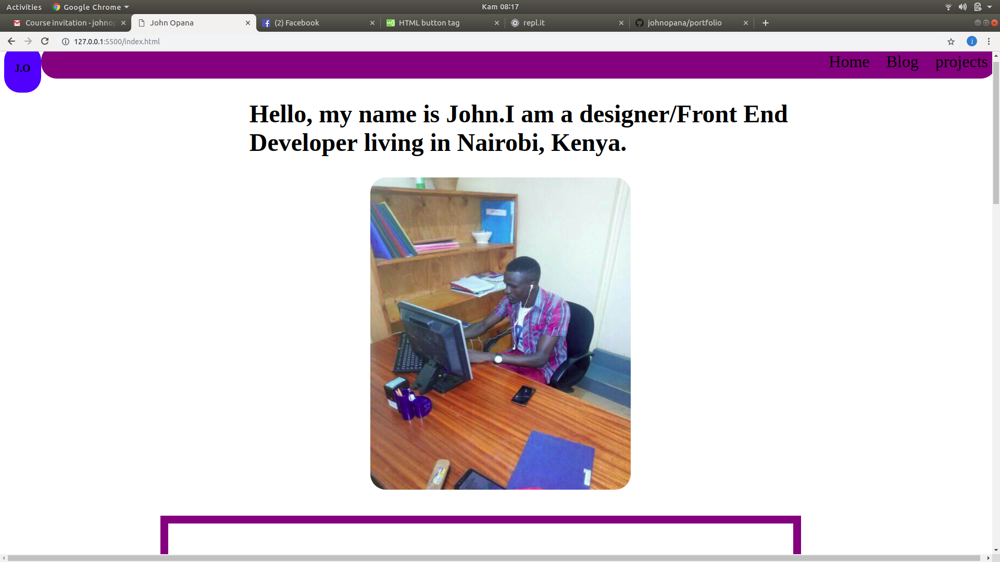

# MY PORTFOLIO

## Author's Name
  JOHN OPANA
<<<<<<< HEAD
  ## Description
  This is an individual portfolio page showing all the projects i have personally done and deployed.

  ## Deployment
  The project can be accessed through github.

  ## Technology used
  -HTML
  -CSS

  ## Bugs
  
  Under development still

  ## Support and contact details
  contact me through;
  -johnopana2016@gmail.com
  -slack me(moringa-school) johnopana.

  ##screenshort

  

  ##livelink

 You can view the live application by following the link https://johnopana.github.io/portfolio/

  ##License

  MIT license

  permision-you are free to  have a look and  make comment , but please feel free to reach me at anytime and day.

  copyright johnopana 2019
=======
>>>>>>> 767849e3f43929b741037f4453a37b898f65dc43
